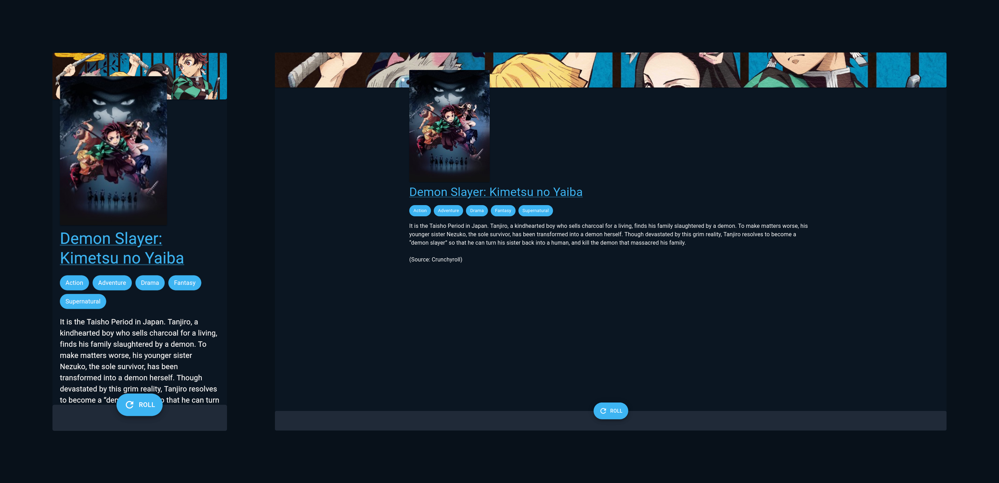

# Aniroll · Random anime picker

Project available on https://mitonik.github.io/aniroll/.



## Find out what anime to watch next.

Just press "Roll" and you'll get information about randomly chosen anime.

## AniList API

This project uses [AniList GraphQL API](https://anilist.gitbook.io/anilist-apiv2-docs/) to fetch media information.

## How to run the project locally?

1. Install dependencies.

   ```
   npm install
   ```

1. Generate Apollo Client files.

   ```
   npm run compile
   ```

1. Start development server.

   ```
   npm run dev
   ```

1. Go to http://localhost:5173/.
